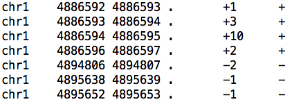
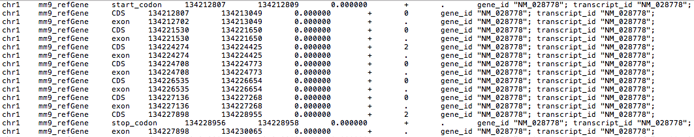
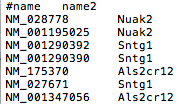
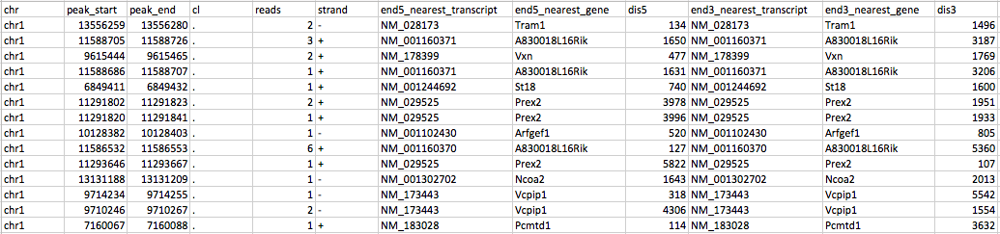
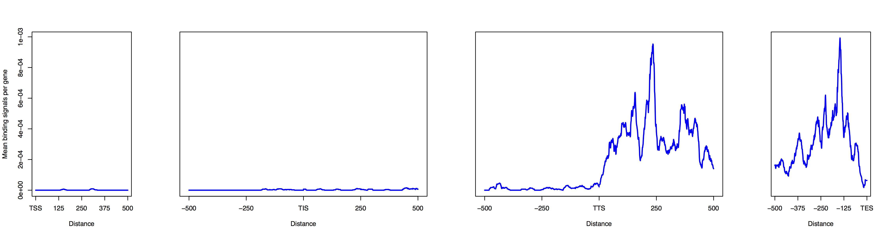
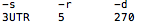
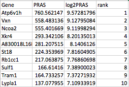
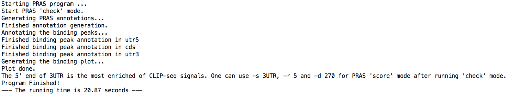
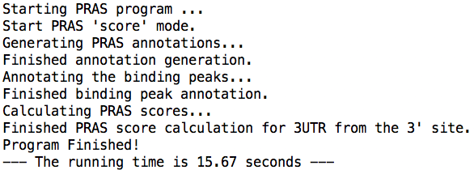

# Examples
All sample datasets can be downloaded from the [Downloads](zipped_code/Downloads.md) page.
## Sample input
PRAS requires a binding table, an annotation table, and an ID table as input files (described in the Instructions).
Here, we present a set of toy datasets as an example for PRAS usage.
The binding table is a subset of the reliable cross-linking sites from CELF4 iCLIP-seq dataset used in our paper. The annotation table is the GTF file of Refseq mm9 annotation. The ID file is the transcript IDs and gene names of Refseq mm9 annotation.
The files looks like the screenshots as below:
### 1. Sample binding table: test_binding_tab.bed

Note that the fifth column could have sign to indicate the strand.
### 2. Sample annotation table: mm9_refseq.gtf

### 3. Sample ID table: mm9_refseq_ID.txt

In addition, PRAS support calculating the scores on a customized gene list via -l option. If it's not given, PRAS will perform the calculation on all the genes in the annotation files.
## Command example
### 1. run PRAS "check" mode to examine the binding profiles around the candidate reference sites.
python PRAS_1.0.py -g mm9_refseq.gtf -t mm9_refseq_id.txt -i test_binding_tab.bed -m check -s transcript -a test_binding_tab_assign.txt -w 10 -c 500 -p check_test
### 2. run PRAS with known reference site.
python PRAS_1.0.py -g mm9_refseq.gtf -t mm9_refseq_id.txt -m score -s 3UTR -i test_binding_tab.bed -a test_binding_tab_assign.txt -w 10 -r 3 -d 1000

## Sample output
### 1. Sample output table 1: test_binding_tab_utr3.assign.txt
In "check" mode, peaks in 5' UTR, CDS and 3' UTR are all annotated. In "score" mode, only peaks in selected genomic region are annotated.
The format of the annotated peak file is consistent for the two modes, which is shown as below.

### 2. Sample output plot: check_test_500nt_around_TSS_TIS_TTS_TES.pdf
If PRAS "check" mode is enabled, the user will get the binding profile plot around the candidate reference sites.
Here is the output plot of the toy dataset when -s transcript is enabled.

We can see the 3'UTR enrichment from the binding profile plots.
In addition, PRAS also allows splice site binding check via -s splice option. Users can try it using RBPs with splicing-related function.
### 3. Sample output suggestion file: check_test_500nt_PRAS_option_suggestions.txt
If PRAS "check" mode is enabled, the user will get the parameter suggestion file based on the binding profile plot around the candidate reference sites.
These parameters can be used in the "score" mode if there is no pre-knowledge of the target RBP.

### 4. Sample output table: binding_PRAS.txt
Given known reference site, PRAS will generate a score table with four columns which are gene name, PRAS score, log2 of PRAS score, and the rank of the gene.

One will get something similar to the following lines if PRAS run successfully.

If PRAS "check" option is enabled, the process is as below:

If PRAS is run with known reference site in "score" mode, the process is as below:

