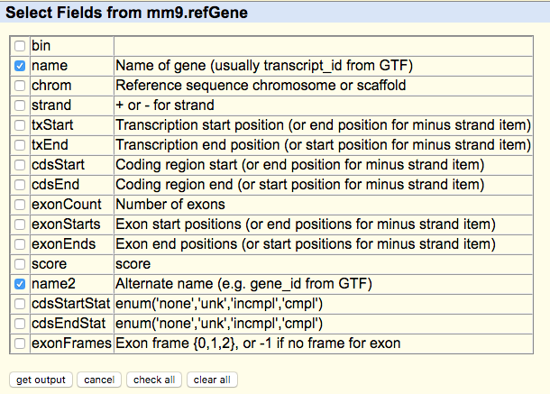

# Instructions
# Prerequisites
## 1. Prepare the data files.
The three required input files of PRAS are the binding file (from CLIP-seq), the annotation file and the ID file.
### a. The binding file.
The binding file has to include the intensity and position information of the binding sites in the 6-column BED (Browser Extensible Data) format. It should be a file with either the reliable cross-linking sites or the reliable binding peaks called by any peak calling algorithm. The fifth column of the BED file should be the intensity of the binding site, read counts for example, and the sixth column should be the strand information, "+" or "-". Consistent with the standard BED file, the columns of the binding file should be tab-seperated. The columns information are shown below:

chr   start   end   read_name    read_counts   strand
...

As for the reliable cross-linking sites or the peak regions, users can generate them from any peak-calling tool. For example, the reliable cross-linking sites in our study (iCLIP-seq) were generated from iCount (http://icount.fri.uni-lj.si) with FDR cutoff as 0.05.
For detailed example of the data files, please refer to Examples.
### b. The annotation file.
The annotation file should be formatted as GTF (Gene Transfer Format). We suggest to download the GTF file of certain genome from the UCSC Table Browser (https://genome.ucsc.edu/cgi-bin/hgTables).
### c. The ID file.
Considering that some of the downloaded GTF file doesn't include the gene name information, we require this additional file with transcript ID and gene name to be linked together. There should be two columns in this file, where the first column is the transcript ID, and the second column is the gene name or gene ID.
One easy way to generate such file is from the UCSC Table Browser. Here are the steps:
1st, select the genome build you want, mm9, for example;
2nd, select the annotation source you want, Refseq, for example;
3rd, select "selected fields from primary and related tables" in the output format option;

4th, check the boxes of "name" and "name2" from the table;
5th, click the "get output".

## 2. Download and install necessary tools.
### a. Bedtools
Bedtools can be downloaded from: http://bedtools.readthedocs.io/en/latest/
Bedtools installation instruction can be found from: http://bedtools.readthedocs.io/en/latest/content/installation.html
### b. Python
Python can be downloaded from: https://www.python.org/downloads/
### c. R
R can be downloaded from: https://www.r-project.org/
Bedtools commands, python and R should be executable.
### d. gtfToGenePred toolkit.
gtfToGenePred can be downloaded from UCSC utility library (http://hgdownload.soe.ucsc.edu/admin/exe/). This tool can transfer the annotation file in GTF format to that in GenePred format. PAS calls this tool in the annotation generating step, so please make it excutable.

# Run PRAS
## 1. [Download the source code of PRAS.](zipped_code/Downloads.md)
PRAS source code can be downloaded from the [Downloads](zipped_code/Downloads.md) page.
## 2. Check help page of PRAS for usage.
PRAS help page can be generated simply by typing:

PRAS_1.0.py -h

in your command window. And you should get the following lines:

[username]$ python PRAS_1.0.py -h

If you get any errors in this command line, please go back to the prerequisites and check.
## 3. Run PRAS on your own datasets.
PRAS have four required arguments: GTF file name, Binding file name, ID file name and the filename for the output peak annotation file.
PRAS have seven optional arguments: running mode, genomic region, half window size, interested gene list, reference site direction (5', 3' or check), distance parameter, and PRAS score output filename.
One can follow the help page of PRAS to run on your own datasets.
If you have problems running the python code, please go to Examples to check the sample command line to run PRAS.
## 4. Collect PRAS output files.
If PRAS is run in 'check' mode instead of 'score' mode, it will output two files. One is a peak annotation file according to the -a option, and the other is the binding profile plot according to the -p option. 'check' will output parameter suggestions that can be used in 'score' mode based on the CLIP peak distribution around the selected reference sites. The suggested parameters include genomic region, reference site, and decay parameter, corresponding to -s, -r, and -d options, respectively. Users can use these suggestions if they don't have any pre-knowledge of the studied RBP.
Given known reference site, PRAS typically will output two files. One is a peak annotation file according to the -a option, and the other is the PRAS score table according to the -o option.
PRAS can work on a set of interested genes provided by a gene list customized by user via -l option. If there's no interested gene list as input, PRAS will take all the genes from the annotation file as the gene list and at the same time PRAS will generate a file called "_all_genels.txt", which can be deleted if it's not being used in the following analysis.
