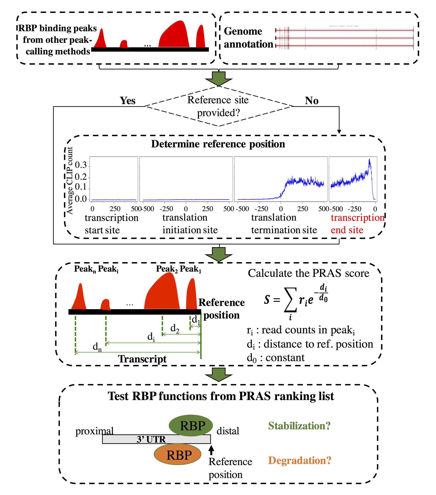

# PRAS
PRAS: predicting functional targets of RNA binding proteins based on CLIP-seq peaks

We designed a tool, Protein-RNA Association Strength (PRAS), for RBP functional targets prediction.
Given the binding  (from CLIP-seq) and reference site (pre-known or interested site) information, it can score genes by combining the binding intensity and position information.
PRAS outputs the PRAS score of each interested gene.

## [Instructions](Instructions.md)
1. Prerequisites
2. Run PRAS

## [Downloads](zipped_code/Downloads.md)
1. Source code
2. Sample data

## [Examples](Examples.md)
1. Sample input
2. Command example
3. Sample output

## Reference
[Lin, J., Zhang, Y., Frankel, W. N., & Ouyang, Z. (2019). PRAS: Predicting functional targets of RNA binding proteins based on CLIP-seq peaks. PLoS computational biology, 15(8), e1007227.](https://journals.plos.org/ploscompbiol/article?id=10.1371/journal.pcbi.1007227)

## License
Use of PRAS is free for academic users under the GNU General Public License (GPL). Commercial users please contact the authors.

## Contact
Zhengqing Ouyang: ouyang@schoolph.umass.edu

Jianan Lin: jianan.lin@jax.org

## Note
The website of PRAS has been moved from http://ouyanglab.jax.org/pras/ to here (https://github.com/ouyang-lab/PRAS/).
